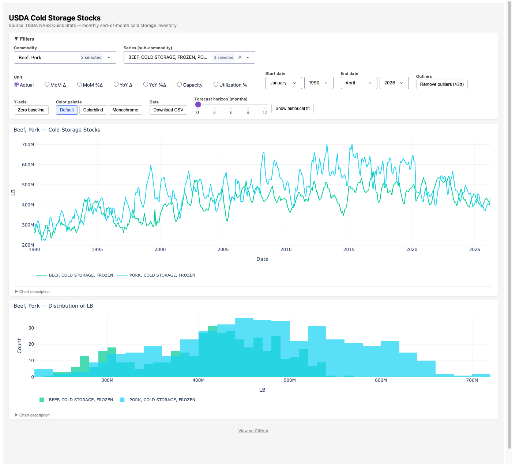

# USDA Cold Storage Dashboard

An interactive web dashboard for visualizing USDA NASS Cold Storage report data — monthly end-of-month inventory levels across 107 commodity series (frozen fruit, vegetables, poultry, red meat, dairy, eggs, nuts, and more).

Built with Plotly Dash, designed to be self-hosted and embedded in a Google Sites page.



## Features

- **Line charts and histograms** of cold storage stocks by commodity and sub-series
- **Unit toggle**: Actual levels / Month-over-month change / Month-over-month % change
- **Date range filter** by month and year
- **Outlier removal** (>3σ from mean)
- **SARIMA forecasting** with 1–12 month horizon, auto-selected order via `pmdarima`
- **Historical fitted values** with 95% confidence intervals
- Full coverage of all series in the USDA NASS Cold Storage monthly report

## Data Source

[USDA NASS Quick Stats API](https://quickstats.nass.usda.gov/api) — free API key required (instant signup).

The dashboard pulls data for:
- **Dairy**: Butter, Natural Cheese
- **Frozen Poultry**: Chickens, Turkeys, Ducks
- **Frozen Red Meat**: Beef, Pork, Veal, Lamb & Mutton
- **Frozen Eggs**
- **Frozen Fruit**: Apples, Apricots, Blackberries, Blueberries, Boysenberries, Cherries, Grapes, Peaches, Raspberries, Strawberries, and more
- **Frozen Juice Concentrate**: Orange
- **Frozen Vegetables**: Asparagus, Beans, Broccoli, Brussels Sprouts, Carrots, Cauliflower, Sweet Corn, Okra, Onions, Peas, Spinach, Squash, Southern Greens, and more
- **Frozen Potatoes**: French Fries, Other
- **Nuts**: Pecans (shelled and in-shell)

## Setup

### Prerequisites

- Python 3.8+
- A free NASS Quick Stats API key from [quickstats.nass.usda.gov/api](https://quickstats.nass.usda.gov/api)

### Install

```bash
git clone https://github.com/ezra-butcher/cold-storage-viz.git
cd cold-storage-viz
pip install -r requirements.txt
```

### Configure

Create a `.env` file in the project root:

```
NASS_API_KEY=your_api_key_here
```

### Run

```bash
# Fetch data, fit forecasts, and start the app
bash run.sh
```

Or run each step individually:

```bash
python fetch_data.py       # ~2 min — pulls all series from the NASS API
python fit_forecasts.py    # ~50 min — fits SARIMA models for all 107 series
python app.py              # starts the Dash app on http://localhost:8050
```

> **Note:** `fit_forecasts.py` uses `pmdarima.auto_arima` with a bounded stepwise search (p/q ∈ [0,3], d ∈ [0,1], P/Q ∈ [0,1], D ∈ [0,1], m=12). Runtime is roughly 50 minutes for all 107 series on a modern laptop. Run it once; re-run monthly when new data is released.

## Deployment (Docker + systemd + Tailscale)

The included `Dockerfile` and `cold-storage-viz.service` are set up for self-hosting on a home server with public access via [Tailscale Funnel](https://tailscale.com/kb/1223/funnel).

### Build and run with Docker

```bash
docker build -t cold-storage-viz .
docker run -d \
  --name cold-storage-viz \
  -p 127.0.0.1:8050:8050 \
  -v "$(pwd)/data:/app/data" \
  --env-file .env \
  cold-storage-viz
```

### systemd service

Copy the service file and enable it:

```bash
sudo cp cold-storage-viz.service /etc/systemd/system/
sudo systemctl daemon-reload
sudo systemctl enable --now cold-storage-viz
```

### Monthly data refresh

A cron job runs `refresh_data.sh` monthly after each NASS Cold Storage release (typically the third or fourth week of the month):

```bash
# Example crontab entry — 6am on the 25th of each month
0 6 25 * * /path/to/cold-storage-viz/refresh_data.sh
```

`refresh_data.sh` re-fetches all data, re-fits forecasts, and restarts the service.

### Embedding in Google Sites

1. Expose the app publicly via Tailscale Funnel
2. In Google Sites: **Insert → Embed → By URL** → paste the Funnel URL
3. All filter state is managed in Dash callbacks (not URL query params), which is required for Google Sites embedding

## Project Structure

```
cold-storage-viz/
├── app.py              # Dash application
├── fetch_data.py       # NASS API data pull
├── fit_forecasts.py    # SARIMA model fitting
├── run.sh              # Sequential runner: fetch → fit → serve
├── refresh_data.sh     # Monthly cron refresh script
├── Dockerfile
├── cold-storage-viz.service  # systemd unit file
├── requirements.txt
└── data/               # Generated — not committed
    ├── cold_storage.parquet
    ├── forecasts.parquet
    └── fitted.parquet
```

## License

MIT
